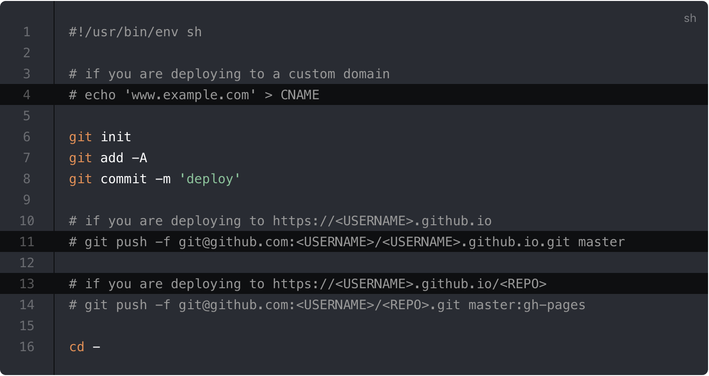

# Markdown Extensions

## Header Anchors


Headers Anchors sẽ được ren tự dộng từ các #TieuDe. Cấu hình [`markdown.anchor`](https://vuepress.vuejs.org/config/#markdown-anchor).

## Links


### Internal Links


các Internal Links (Relative link) được router tương ứng (`<router-link>`). Mọi file `README.md` hoặc `index.md` trong mỗi sub-directory đc converted to `index.html` vơí URL `/`.


Xem ví dụ:


```
.
├─ README.md
├─ foo
│  ├─ README.md
│  ├─ one.md
│  └─ two.md
└─ bar
   ├─ README.md
   ├─ three.md
   └─ four.md
```


Khi đang sửa tại file `foo/one.md` sẽ là:

```md
[Home](/) <!-- send user tới README.md root của project-->
[foo](/foo/) <!-- send user tơới index.html root của foo -->
[foo heading](./#heading) <!-- tới heading của foo/README.md file -->
[bar - three](../bar/three.md) <!-- tới file three.md -->
[bar - four](../bar/four.html) <!-- có thể điều hương tới file = .html (ko recommended = .md) -->

<!-- lưu ý đường dẫn tuyệt đối và đường dẫn tương đối (có dấu . ở trước) -->
<!-- ./file: file cùng folder      ../file: nhảy ra ngoài folder -->
```


### Redirection for URLs


VuePress hỗ trợ redicrect link khi `/foo` is not found, VuePress sẽ cố gắng tìm `/foo/` or `/foo.html`, customize [vuepress-plugin-clean-urls](https://vuepress.github.io/plugins/clean-urls/).


### Page Suffix


Pages and internal links get generated with the `.html` suffix by default.

You can customize this by setting [config.markdown.pageSuffix](https://vuepress.vuejs.org/config/#markdown-pagesuffix).


### External Links

VD là 2 link sau:

- [vuejs.org](https://vuejs.org)
- [VuePress on GitHub](https://github.com/vuejs/vuepress)

```md
- [vuejs.org](https://vuejs.org)
- [VuePress on GitHub](https://github.com/vuejs/vuepress)
```

html tag sẽ automatically có `target="_blank" rel="noopener noreferrer"`

You can customize the attributes added to external links by setting [config.markdown.externalLinks](https://vuepress.vuejs.org/config/#markdown-externallinks).

## Frontmatter

[YAML frontmatter](https://jekyllrb.com/docs/frontmatter/) VD format cho yaml:

``` yaml
---
title: Blogging Like a Hacker
lang: en-US
---
```

````md
```tenNgonNgu
    code here
```
````

::: tip Lưu ý
Số lượng đấu ``` có thể tăng tùy thích
:::

Xem thêm [Frontmatter](https://vuepress.vuejs.org/guide/frontmatter.html).

## GitHub-Style Tables

**Input**

```
| Tables        | Are           | Cool  |
| ------------- |:-------------:| -----:|
| col 3 is      | right-aligned | $1600 |
| col 2 is      | centered      |   $12 |
| zebra stripes | are neat      |    $1 |
```

**Output**

| Tables        | Are           | Cool  |
| ------------- |:-------------:| -----:|
| col 3 is      | right-aligned | $1600 |
| col 2 is      | centered      |   $12 |
| zebra stripes | are neat      |    $1 |
## Emoji :tada:

**Input**

```
:tada:
```

**Output**

:tada:

A [list of all emojis](https://github.com/markdown-it/markdown-it-emoji/blob/master/lib/data/full.json) is available.

## Table of Contents

**Input**

```
[[toc]]
```

**Output**

<!--lint disable no-shortcut-reference-link no-undefined-references-->

[[toc]]

<!--lint enable no-shortcut-reference-link no-undefined-references-->

Rendering of the TOC can be configured using the [`markdown.toc`](https://vuepress.vuejs.org/config/#markdown-toc) option.

## Thẻ `Badge`

Input

```md
<Badge text="Tiêu văn đề" />
<Badge text="beta" type="warning"/>
```

Output

<Badge text="Tiêu văn đề" />
<Badge text="Beta" type="warning"/>

## Custom Containers <Badge text="default theme"/>


Custom containers can be defined by their types, titles, and contents.


### Default Title

**Input**

```md

::: tip [title]
This is a tip
:::

::: warning [title]
This is a warning
:::

::: danger [title]
This is a dangerous warning
:::

::: details [title]
This is a details block, which does not work in IE / Edge
:::
```


**Output**

::: tip Tiêu đề
This is a tip
:::

::: warning
This is a warning
:::

::: danger
This is a dangerous warning
:::

::: details Siêu nhân bay
This is a details block, which does not work in Internet Explorer or Edge.
:::

### Custom Title

**Input**

````md
::: danger STOP
Danger zone, do not proceed
:::

::: details Click me to view the code
```js
console.log('Hello, VuePress!')
```
:::
````
**Output**

::: danger STOP
Danger zone, do not proceed
:::


::: details Click me to view the code
```js
console.log('Hello, VuePress!')
```
:::

**Also see:**

- [vuepress-plugin-container](https://vuepress-community.netlify.app/en/plugins/container/#vuepress-plugin-container)

## Syntax Highlighting in Code Blocks

VuePress dùng [Prism](https://prismjs.com/) để hỗ trợ viết code block có format. các dùng như bên dưới _**(số lượng dấu ``` nhiều ít tùy thích nhưng sl của mở phải = đóng)**_ :

**Input**

````
``` js
export default {
  name: 'MyComponent',
  // ...
}
```
````

**Output**

``` js
export default {
  name: 'MyComponent',
  // ...
}
```

**Input**

````
``` html
<ul>
  <li
    v-for="todo in todos"
    :key="todo.id"
  >
    {{ todo.text }}
  </li>
</ul>
```
````

**Output**

``` html
<ul>
  <li
    v-for="todo in todos"
    :key="todo.id"
  >
    {{ todo.text }}
  </li>
</ul>
```

A [list of valid languages](https://prismjs.com/#languages-list) is available on Prism’s site.

## Line Highlighting in Code Blocks

**Input**

````
``` js{4}
export default {
  data () {
    return {
      msg: 'Highlighted!'
    }
  }
}
```
````

**Output**

``` js{4}
export default {
  data () {
    return {
      msg: 'Highlighted!'
    }
  }
}
```

Cách highlight multiple single lines, ranges, or both:

- Line ranges: `{5-8}`, `{3-10}`, `{10-17}`

- Multiple single lines: `{4,7,9}`

- Line ranges kết hợp single lines: `{4,7-13,16,23-27,40}`

**Input**

````
``` js{1,4,6-7}
export default { // Highlighted
  data () {
    return {
      msg: `Highlighted!
      This line isn't highlighted,
      but this and the next 2 are.`,
      motd: 'VuePress is awesome',
      lorem: 'ipsum',
    }
  }
}
```
````

**Output**

``` js{1,4,6-8}
export default { // Highlighted
  data () {
    return {
      msg: `Highlighted!
      This line isn't highlighted,
      but this and the next 2 are.`,
      motd: 'VuePress is awesome',
      lorem: 'ipsum',
    }
  }
}
```

## Line Numbers

Trong config.js:

``` js
module.exports = {
  markdown: {
    lineNumbers: true
  }
}
```

Demo:



## Import Code Snippets <Badge text="beta" type="warning"/>

Có thể import code từ file vào như sau:

``` md
<<< @/filepath
Tự tìm hiểu
<<< @/../duong_dan_tuyet_doi
```

Hộ trợ **highlight** code luôn:

``` md
<<< @/filepath{highlightLines}
Tự tìm hiểu
<<< @/../duong_dan_tuyet_doi{highlightLines}
```

VD:

**Input**

``` md
<<< @/../docs/src/guide/asset/code_import.vue{3}
```

**Output**

<<< @/../docs/src/guide/asset/code_import.vue{3}


::: tip
Since the import of the code snippets will be executed before webpack compilation, you can’t use the path alias in webpack. The default value of `@` is `process.cwd()`.
:::

Có thể lấy 1 đoạn code bằng [VS Code region](https://code.visualstudio.com/docs/editor/codebasics#_folding) to only include the corresponding part of the code file. You can provide a custom region name after a `#` following the filepath (`snippet` by default):

**Input**

``` md
<<< @/../docs/src/guide/asset/code_import.vue#snippet{1}
```

**Output**

<<< @/../docs/src/guide/asset/code_import.vue#snippet{1}

## Advanced Configuration

Tham khảo [markdown-it](https://github.com/markdown-it/markdown-it). Để config thêm `markdown-it` sử dụng `markdown` option trong `.vuepress/config.js`:

``` js
module.exports = {
  markdown: {
    // options for markdown-it-anchor
    anchor: { permalink: false },
    // options for markdown-it-toc
    toc: { includeLevel: [1, 2] },
    extendMarkdown: md => {
      // use more markdown-it plugins!
      md.use(require('markdown-it-xxx'))
    }
  }
}
```
